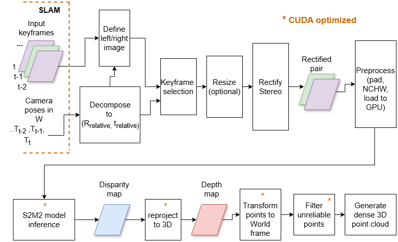
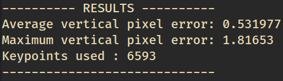

# Near real-time 3D stereo reconstruction from drone imagery and SLAM pose estimations. - Branch : ros2_impl

This is the branch that is meant to work in real time scenarios and be integrated with SLAM. It receives images and poses through ROS2 topics and runs the full stereo vision pipeline. The main packages are *s2m2_inference_cpp_pkg* and *pointcloud_generator_pkg*. The first is responsible for handling the ROS2 communication with the SLAM system that provides images and poses, and will finally output the 3D points on a Ros2 topic. The second node simply receives the 3D points along with color information from the left rectified image, and populates a pointcloud message. 
Optional saving of images and pointclouds can be configured through ROS parameters. 





Please read the "How to use this branch" for detailed setup information. 


## Table of contents
- [Near real-time 3D stereo reconstruction from drone imagery and SLAM pose estimations. - Branch : ros2\_impl](#near-real-time-3d-stereo-reconstruction-from-drone-imagery-and-slam-pose-estimations---branch--ros2_impl)
  - [Table of contents](#table-of-contents)
  - [How to use this branch](#how-to-use-this-branch)
    - [Dependencies](#dependencies)
    - [Code preparation](#code-preparation)
    - [Launch](#launch)
  - [Debug - GDB support](#debug---gdb-support)
  - [Saving images and pointclouds](#saving-images-and-pointclouds)
  - [GPU monitoring](#gpu-monitoring)
  - [Rectification evaluation tool](#rectification-evaluation-tool)
  - [Acknowledgements](#acknowledgements)
  - [Contact](#contact)


## How to use this branch

### Dependencies
System has been tested on linux772 server of ITC. In case of setup on different  machine, some dependencies might need to be setup again. However, the code could work with future versions of TensorRT as long as the .engine file can be exported.

System info : 
- Ubuntu 22.04
- Ros2 Humble
- CUDA 13.0
- TensorRT 10.13.3 found in https://developer.download.nvidia.com/compute/tensorrt/10.13.3/local_installers/nv-tensorrt-local-repo-ubuntu2204-10.13.3-cuda-13.0_1.0-1_amd64.deb
- OpenCV 4.13 built from source with CUDA modules and contrib_modules enabled. 
- vision_opencv packages built from workspace folder to link against opencv 4.13 instead of the default version of ros2 humble. 


---
To install ROS2 Humble, follow the guide 
provided on [Ros2 Humble debian packages](https://docs.ros.org/en/humble/Installation/Ubuntu-Install-Debs.html)

---
To build the OpenCV from source, run the following bash commands: 
```
wget -O opencv.zip https://github.com/opencv/opencv/archive/refs/tags/4.13.0.zip
wget -O opencv_contrib.zip https://github.com/opencv/opencv_contrib/archive/refs/tags/4.13.0.zip
unzip opencv.zip
unzip opencv_contrib.zip
cd opencv-4.13.0
mkdir build && cd build

cmake -DCMAKE_BUILD_TYPE=RELEASE -DCMAKE_INSTALL_PREFIX=/opt/opencv_cuda -DOPENCV_EXTRA_MODULES_PATH=../../opencv_contrib-4.13.0/modules -DWITH_CUDA=ON -DWITH_CUDNN=ON -DWITH_CUBLAS=ON -DWITH_TBB=ON -DWITH_QT=ON -DWITH_OPENGL=ON -DOPENCV_DNN_CUDA=ON -DENABLE_FAST_MATH=ON -DCUDA_FAST_MATH=ON -DCUDA_ARCH_BIN=8.6 -DCUDA_ARCH_PTX=8.6 -DOPENCV_GENERATE_PKGCONFIG=ON -DOPENCV_ENABLE_NONFREE=ON -DBUILD_EXAMPLES=OFF ..
```
You can ensure that the CMake path is correctly pointing to /opt/opencv_cuda by running : 
```
cd opencv-4.13.0/build
grep "CMAKE_INSTALL_PREFIX:PATH" CMakeCache.txt
```
---
To install NVIDIA's TensorRT: 

- Visit https://developer.nvidia.com/tensorrt/download/10x 
- Find and download the package named : TensorRT 10.13.3 GA for Ubuntu 22.04 and CUDA 13.0 DEB local repo Package  -  this should be the suitable for our sever and tested for the model of interest.
- Next, follow the steps from https://docs.nvidia.com/deeplearning/tensorrt/latest/installing-tensorrt/installing.html#installing-debian 
- sudo dpkg -i nv-tensorrt-local-repo-ubuntu2404-10.x.x-cuda-x.x_1.0-1_amd64.deb
- sudo cp /var/nv-tensorrt-local-repo-ubuntu2404-10.x.x-cuda-x.x/*-keyring.gpg /usr/share/keyrings/
- sudo apt-get update
- sudo apt-get install tensorrt

You might need to also specify the library path of CUDA for the dynamic linker using : 
`export LD_LIBRARY_PATH=/usr/local/cuda-13.0/lib64:$LD_LIBRARY_PATH`

---
### Code preparation


1. `git clone https://github.com/Rektino/thesis.git`
   
2. Download the weights of the S model of s2m2 as provided in [S2M2 github](https://github.com/junhong-3dv/s2m2). 
3. Run: 
    ```
    mkdir weights
    mkdir weights/pretrain_weights
    ```
    and place the weights file there. 
4. Set up the conda environment as described in [S2M2 github](https://github.com/junhong-3dv/s2m2), before exporting the model in the next steps. 
   
5. Export the s2m2 model in ONNX format: 
Follow the guide on [S2M2 github](https://github.com/junhong-3dv/s2m2), but use the code within this repo under alg-S2M2 instead of cloning s2m2. That is because there were some bugs when exporting with the original scripts.
**Important note**: For the exporting, use image dimensions that are multiples of 32. If the original images do not have a multiple of 32 dimensions, the padding will occur in the images(included within the code), so take into account the final dimensions of the images before exporting the tensorRT engine.

1. Once ONNX file is exported, follow again the guide on [S2M2 github](https://github.com/junhong-3dv/s2m2) for the TensorRT exporting. Use -fp16 as precision and the image sizes accordingly. Once it's done, exit the conda environment.
[**WARNING**] **Make sure to export the model with tenosr dimensions on multiples of 32. Based on the original image dimensions, a padding may occur in the images(included within the code), so take into account the final dimensions of the images before exporting the tensorRT engine.**
1. The sample images and weights are not included in the branch to save size. Therefore, select the 4 images from M13_2018 dataset that you want to test, and adjust the paths stated under:
 **ros2_impl/cpp_ws/s2m2_inference_cpp_pkg/config/params.yaml**
You can use the 4 images I used (which produce 3 stereo pairs), for convenience of the next steps.

1. Edit the camera parameters from within the file : **cpp_ws\ros2_impl\s2m2_inference_cpp_pkg\include\cam_params_rosbag.hpp**. By default, these are set based on the M13_2018 dataset based on Pix4D's auto-calibration for the intrinsics. 
2. Adjust further any desired ROS parameters of the application on s2m2_inference_cpp_pkg/config/params.yaml and under pointcloud_pkg/config/params.yaml .
3.   Build first the custom messages package and then the whole workspace with the custom build command provided as a shell script :
  ```
  cd cpp_ws/ros2_impl
  colcon build --packages-select my_custom_interfaces
  source install/setup.bash
  bash updated_build_command.sh
  source install/setup.bash
  ```
  Notice that some ros2 packages under vision_opencv are built from source, because their system-wide version that comes with ROS2 Humble does not have the Opencv 4.13 that we use here! So by overriding the system packages we escape dependency conflicts.

1.   Run  `source install/setup.bash`  

### Launch 

We use a separate package for launching our nodes which is a common practice in ROS2:

`ros2 launch stereo_system_bringup_pkg stereo_system_bringup.launch.py`


## Debug - GDB support 

For debugging, gdb can be attached to a node, as an extra argument at launch time. 

To install it : 
```
sudo apt update
sudo apt install gdb libc6-dbg
```

I used xterm for the debugging terminal session. Example to activate debugging both s2m2 inference and the pointcloud node: 

`ros2 launch stereo_system_bringup_pkg stereo_system_bringup.launch.py gdb_debug_s2m2_node:=true gdb_debug_pointcloud_node:=true`
 

Also, make sure to enable DEBUG build from 
CMakeLists.txt : 

`set(CMAKE_BUILD_TYPE Debug)`

For best performance, switch back to release: 

`set(CMAKE_BUILD_TYPE Release)`

## Saving images and pointclouds

Under each ROS2 package, there is a config/ folder containing a params.yaml file. There are boolean parameters like `save_pcl` or `save_rectified_images` to save the pointclouds and images. Do not activate these while in Release version or while testing performance, as it causes delays. 

## GPU monitoring 

An extra experimental package named *gpu_monitoring_pkg* has been added. This package contains a node that can track how busy the GPU's PCI bus is, how much is the power consumption and the memory usage. It is not guaranteed to work as expected because there was insufficient time to test.  

The node queries at a specified frequency GPU stats using the *nvml* library, and publishes them on a ros2 topic with a custom message. It publishes the following custom message on a **/gpu_metrics** topic : 
*my_custom_interfaces::msg::GpuMetrics*


## Rectification evaluation tool 


In order to obtain accurate and reliable 3D points, a reliable stereo rectification is the single most important step of the pipeline. It heavily depends on the quality of the pose estimation from SLAM and from the camera calibration quality. A satisfactory rectification should make the epipolar lines purely horizontal, meaning that identical image features should lie on the same Y-value on both left and right image.  

To assess the quality of a rectified pair, I created a simple tool that is based on SIFT feature descriptors and FLANN-based matching. It keeps reliable matches only by applying Lowe's ratio test and also removing the top 5% of errors, because some matches stem from non-shared/occluded pixels, and are invalid. 

To build the executable : 
```
cd cpp_ws/rectification_eval_tool
mkdir build && cd build
cmake .. 
make 
```

Then run it passing the image filepaths : 
```
./evaluate_rectification <left_rectified_path> <right_rectified_path>
```



## Acknowledgements

This project uses the S2M2 model(Junhong Min et al.). I would like to thank them for their work and for providing this open-source model. 
``` bibtex
@inproceedings{min2025s2m2,
  title={{S\textsuperscript{2}M\textsuperscript{2}}: Scalable Stereo Matching Model for Reliable Depth Estimation},
  author={Junhong Min and Youngpil Jeon and Jimin Kim and Minyong Choi},
  booktitle={Proceedings of the IEEE/CVF International Conference on Computer Vision (ICCV)},
  year={2025}
}
```


## Contact

If you have any questions regarding the code, please contact me at geoder.097@gmail.com.


