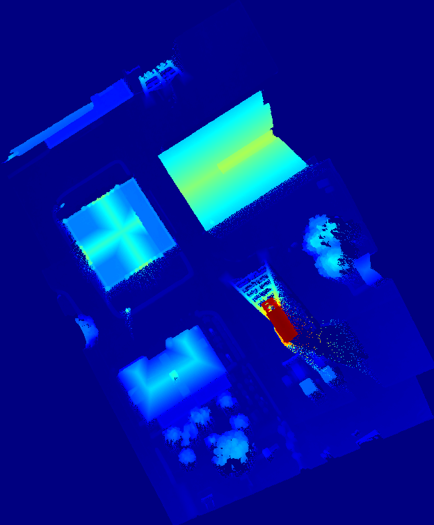
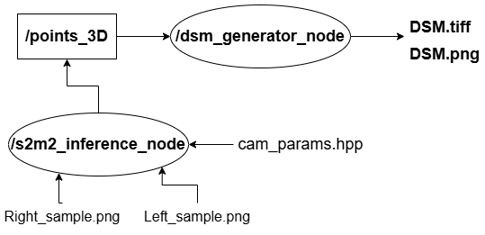

# Near real-time 3D stereo reconstruction from drone imagery and SLAM pose estimations. - Branch : dsm

- [Near real-time 3D stereo reconstruction from drone imagery and SLAM pose estimations. - Branch : dsm](#near-real-time-3d-stereo-reconstruction-from-drone-imagery-and-slam-pose-estimations---branch--dsm)
  - [DSM example](#dsm-example)
  - [Code preparation](#code-preparation)
  - [Contact](#contact)

On this branch, I generate a Digital Surface Model instead of dense point clouds. The s2m2 inference node works
identically to the uav2_samples and full_resolution_uav branches, where image samples from M13_2018 dataset are used. 

DSMs are much lighter often contain sufficient information for inspecting an area. 

The newy added node is within *dsm_generator_pkg*, and inside the config folder one can define the steps for X,Y and how many depthmaps will be combined within one DSM. 

Since this package was based on sample images from M13_2018 dataset, the node sitches a few depthmaps into one DSM and stops. This node can also replace the *pointcloud_generator* node on the main branch(ros2_impl). 

## DSM example 

## Code preparation 

**Identical to the other sample-based branches**. See *full_resolution_uav* on how to export the TensorRT engine file of S2M2, build OpenCV 4.13 with cuda modules enabled, and how to build and launch the nodes. 

## Contact

If you have any questions regarding the code, please contact me at geoder.097@gmail.com 

